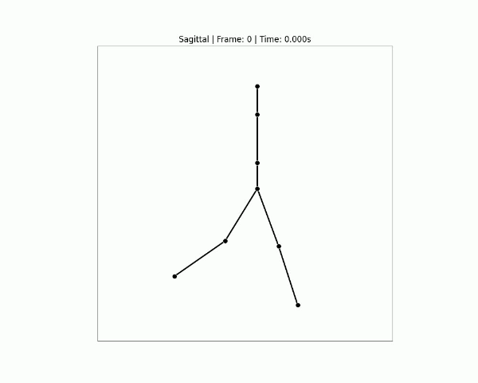
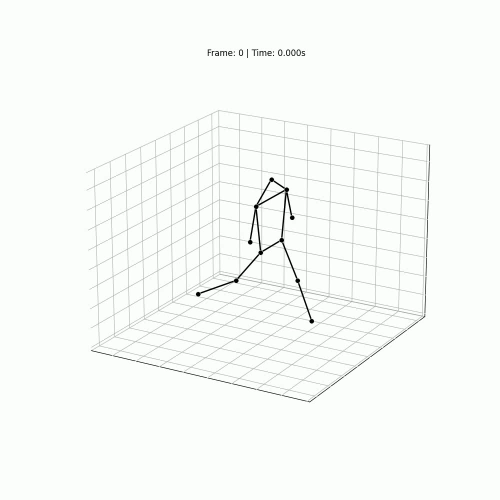

# Gait Skeleton Visualization

A Python tool for creating skeleton animation videos from gait analysis marker data.

## Demo

<p align="center">
  
  
</p>

<p align="center">
  <em>Left: Sagittal (side) view | Right: 3D view</em>
</p>

## Features

- **Load CSV marker data**
- **Customizable skeleton models** - Define marker sets via YAML files
- **3D visualization** - View from any angle
- **2D visualization** - Sagittal, frontal, and transverse planes
- **Multi-view display** - Show all three planes simultaneously
- **MP4 video export**

## Installation

```bash
# Clone the repository
git clone https://github.com/Taiyou/gait-skeleton-visualization.git
cd gait-skeleton-visualization

# Create virtual environment (recommended)
python -m venv venv
source venv/bin/activate  # Linux/Mac
# or
.\venv\Scripts\activate  # Windows

# Install dependencies
pip install -r requirements.txt
```

## Quick Start

### 1. Generate Sample Data

```bash
python scripts/generate_realistic_gait.py
```

This creates test CSV files in the `data/` folder with realistic gait motion data.

### 2. Create Videos

```bash
# 3D view
python main.py -i data/realistic_gait.csv -o output/skeleton_3d.mp4 -v 3d

# Sagittal view (side view)
python main.py -i data/realistic_gait.csv -o output/skeleton_sagittal.mp4 -v sagittal

# Frontal view (front view)
python main.py -i data/realistic_gait.csv -o output/skeleton_frontal.mp4 -v frontal

# Multi-view (all three planes)
python main.py -i data/realistic_gait.csv -o output/skeleton_multi.mp4 -v multi

# Show marker labels
python main.py -i data/realistic_gait.csv -o output/skeleton_labels.mp4 -v 3d --show-labels
```

## Command Line Options

| Option | Short | Description | Default |
|--------|-------|-------------|---------|
| `--input` | `-i` | Input CSV file path | (required) |
| `--output` | `-o` | Output MP4 file path | (required) |
| `--config` | `-c` | Marker set configuration file | `config/marker_sets.yaml` |
| `--marker-set` | `-m` | Marker set name to use | `simple` |
| `--view` | `-v` | View type (3d/sagittal/frontal/transverse/multi) | `3d` |
| `--frame-rate` | `-f` | Input data frame rate (Hz) | `100` |
| `--output-fps` | | Output video FPS | `30` |
| `--show-labels` | | Show marker labels | `False` |
| `--start-frame` | | Start frame | `0` |
| `--end-frame` | | End frame | all frames |
| `--marker-size` | | Marker point size | `50` |
| `--line-width` | | Skeleton line width | `2.0` |
| `--auto-skeleton` | | Auto-create skeleton from data (no connections) | `False` |

## CSV Format

The input CSV should follow this format:

```csv
Frame,HEAD_X,HEAD_Y,HEAD_Z,LSHO_X,LSHO_Y,LSHO_Z,...
0,100.5,0.0,1700.2,80.2,200.0,1500.3,...
1,100.6,0.1,1700.1,80.3,200.1,1500.2,...
```

- First column: Frame number or timestamp
- Subsequent columns: `MarkerName_X`, `MarkerName_Y`, `MarkerName_Z` format

## Customizing Marker Sets

Edit `config/marker_sets.yaml` to define custom marker sets:

```yaml
my_custom_set:
  name: "My Custom Markers"
  description: "Custom marker set"

  markers:
    - MARKER1
    - MARKER2
    - MARKER3

  connections:
    - [MARKER1, MARKER2]
    - [MARKER2, MARKER3]

  colors:
    default: "#000000"
```

To use:

```bash
python main.py -i data/my_data.csv -o output/video.mp4 -m my_custom_set
```

## Python API Usage

```python
from src.data_loader import DataLoader
from src.skeleton_model import SkeletonModel
from src.visualizer_3d import Visualizer3D
from src.video_exporter import VideoExporter

# Load data
loader = DataLoader()
loader.load_csv("data/sample.csv", frame_rate=100.0)

# Load skeleton model
skeleton = SkeletonModel.from_yaml("config/marker_sets.yaml", "simple")
skeleton = skeleton.filter_markers(loader.markers)

# Create visualizer
visualizer = Visualizer3D(skeleton)
visualizer.set_bounds(loader.get_data_bounds())

# Get position data for all frames
all_positions = loader.get_all_positions()

# Generate animation frames
frames = visualizer.create_animation_frames(all_positions, frame_rate=100.0)

# Export video
exporter = VideoExporter(output_fps=30)
exporter.export(frames, "output/video.mp4")
```

## Project Structure

```
gait-skeleton-visualization/
├── main.py                    # Main script
├── requirements.txt           # Dependencies
├── README.md                  # This file
├── config/
│   └── marker_sets.yaml       # Marker set definitions
├── src/
│   ├── __init__.py
│   ├── data_loader.py         # CSV data loading
│   ├── skeleton_model.py      # Skeleton model definition
│   ├── visualizer_3d.py       # 3D visualization
│   ├── visualizer_2d.py       # 2D visualization
│   └── video_exporter.py      # Video export
├── scripts/
│   ├── generate_sample_data.py      # Basic sample data generation
│   └── generate_realistic_gait.py   # Realistic gait data generation
├── data/                      # Data files
└── output/                    # Output videos
```

## Coordinate System

- **X-axis**: Anterior-Posterior (forward-backward)
- **Y-axis**: Medio-Lateral (left-right)
- **Z-axis**: Vertical (up-down)

## Troubleshooting

### "No module named 'cv2'" error

```bash
pip install opencv-python
```

### "ffmpeg not found" error (when creating videos with audio)

Install FFmpeg:

```bash
# Mac
brew install ffmpeg

# Ubuntu/Debian
sudo apt install ffmpeg

# Windows
# Download from https://ffmpeg.org/download.html
```

### Markers not displaying

1. Verify CSV column names follow `MarkerName_X`, `MarkerName_Y`, `MarkerName_Z` format
2. Use `--auto-skeleton` option to auto-create skeleton from data

## License

MIT License
